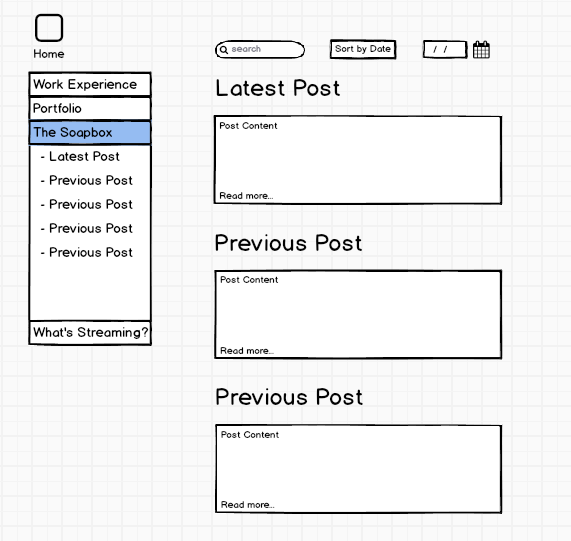
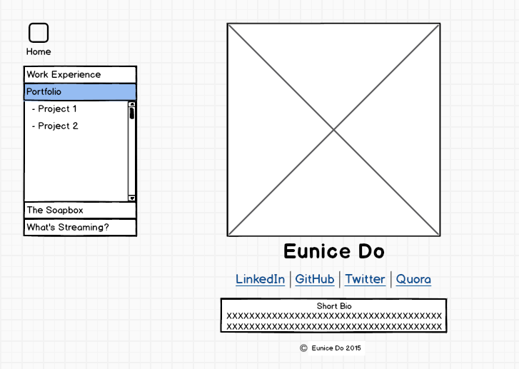

What is a wireframe?
A wireframe can be thought of as a blueprint of a site. It should be created before coding the semantic framework in HTML5. 

What are the benefits of wireframing?
Wireframing is important to the overall site creation because it visually establishes site features and the information hierarchy, which greatly aides in the process of coding.

Did you enjoy wireframing your site?
It helped me plan out the linking structure of all the different pages that I plan to include in my site. I enjoyed figuring out my information hierarchy, but as many others have warned, I did fall into the rabbit hole due to the plethora of options.

Did you revise your wireframe or stick with your first idea?
I stuck with my first idea for each wireframe I created and just made slight adjustments.

What questions did you ask during this challenge? What resources did you find to help you answer them?
I wondered what the typical wireframe page structure included, and learned on http://webdesign.tutsplus.com/ that they usually follow a header, body, footer framework in the same way that HTML files are set up. I also found a great wireframing demo tool that allows you to create wireframes straight from your browser: webdemo.balsamiq.com.

Which parts of the challenge did you enjoy and which parts did you find tedious?
I enjoyed adding structure to my pages and the flow of my site links, and I found the wireframing adjustments to be most tedious.