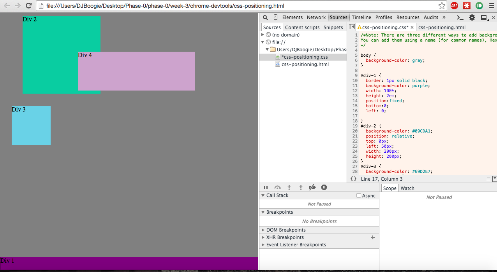

3.4 Exercise Screenshots

1. 
2. 
4. 
3. 
5. 
6. 
7. 
8. 
9. 

3.4 Challenge Reflection

<b>1. How can you use Chrome's DevTools inspector to help you format or position elements?</b>
DevTools makes it really quick and easy to see how a code tweak will immediately affect the page. When troubleshooting a bug like a formatting issue, DevTools allows for highlighting of specific page elements all with a mouse scroll over different code sections to help you identify where the issue is stemming from. It's essentially a very helpful visual of how the browser is interpreting our code.

<b>2. How can you resize elements on the DOM using CSS?</b>
Any CSS property that allows you to manipulate element sizing will suffice here. Examples include width, height, font-size, padding, margin, border-size, etc.

<b>3. What are the differences between Absolute, Fixed, Static, and Relative positioning? Which did you find easiest to use? Which was most difficult?</b>

- Absolute: The element is taken entirely out of the flow of the page layout. Its position is dependent on the nearest element with a relative position, called the nearest positioned ancestor. If such an element doesn't exist, then the absolutely positioned element will be relative to the initial page container.
- Fixed: There is no space left for the element. It's positioned relative to the screen's view and does not move when a user scrolls through the page. This fixed element is on every single page.
- Static: An element is laid out in its current position in the flow of the overall page layout. Top, bottom, right, left, and z-index properties will not apply.
- Relative: The element's position depends on the position of the elements around it. When adjusting an element with a relative position, it will leave an empty space where it would have been if it weren't adjusted.

Fixed positions were the easiest to use because they are the easiest to understand. Second most used was relative positioning. We had no use for static positions in the challenges, and absolute positioning is personally the hardest to grasp.

<b>4. What are the differences between Margin, Border, and Padding?</b>
Margin is the spacing outside of the element's container. Border is the spacing of the container's border. Padding is the spacing between the content inside the container and the container's border.

<b>5. What was your impression of this challenge overall? (love, hate, and why?)</b>
I enjoyed this challenge because each exercise was a mini-puzzle that pushed my pair and I to research and learn new CSS properties. It was rewarding being able to match the screenshots with sound CSS rather than CSS workarounds that would cheat us of our learning.