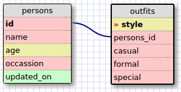

Release 5: 
1.  
SELECT * FROM states;  

2. 
SELECT * FROM regions;  

3.  
SELECT state_name, population 
FROM states;  

4. 
SELECT state_name, population 
FROM states 
ORDER BY population DESC;  

5. 
SELECT state_name  
FROM states 
WHERE region_id = 7;  

6. 
SELECT state_name, population_density 
FROM states 
WHERE population_density > 50 
ORDER BY population_density ASC;  

7. 
SELECT state_name  
FROM states 
WHERE population BETWEEN 1000000 and 1500000;  

8. 
SELECT state_name, region_id  
FROM states 
ORDER BY region_id ASC;  

9. 
SELECT region_name 
FROM regions 
WHERE region_name LIKE '%Central';  

10. 
SELECT state_name, region_name 
FROM regions 
JOIN states 
ON states.region_id = regions.id 
ORDER BY region_id ASC;   

Release 6: 

  

Release 7: 
<b>1. What are databases for?</b> 
Databases are used for storing data in a structured way for easy search and access.  

<b>2. What is a one-to-many relationship?</b> 
It's when 2 fundamentally different objects share a relationship where the first object belongs to the second object, and the second object has many types of the first object.  

<b>3. What is a primary key? What is a foreign key? How can you determine which is which?</b> 
A primary key is a table column containing unique values. When a primary key is used as a column of another table and its values are used more than once in this other table, it is the foreign key of this other table.  

<b>4. How can you select information out of a SQL database? What are some general guidelines for that?</b> 
Use the SELECT command to send a query to the table of choice. This will return a result set in the form of a table. The general guideline looks like this: SELECT column_name FROM table_name;
