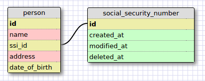
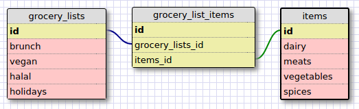

Release 2: 
 
This image is of a one to one relationship because a person can only have one social security number, and a social security number can only be assigned to one person once. However, a person not native to the US may not have a social security number, and so that value may be null.  

Release 4: 
  

Release 6: 
<b>What is a one-to-one database?</b> 
This is a database where Table A has a direct, unique relationship with Table B. One table can contain null values of the other table.  

<b>When would you use a one-to-one database? (Think generally, not in terms of the example you created).</b> 
You would use one when you want to establish a table pairing of unique objects, where one object may not necessarily always have its pair value.  

<b>What is a many-to-many database?</b> 
Table A may contain many types of Table B, and Table B may contain many types of Table A. For example, one Author can write many Books, and one Book can be written by many Authors. This information can be selectively viewed in a join table for specific overlapping occurrences.   

<b>When would you use a many-to-many database? (Think generally, not in terms of the example you created).</b> 
You'd use one to illustrate all the relationships 2 objects may have with each other.

<b>What is confusing about database schemas? What makes sense?</b> 
Schemas are confusing in that it's hard to structure all the fields under each one since they are kind of like open ended questions. The one-to-one, one-to-many, and many-to-many concepts make sense.
